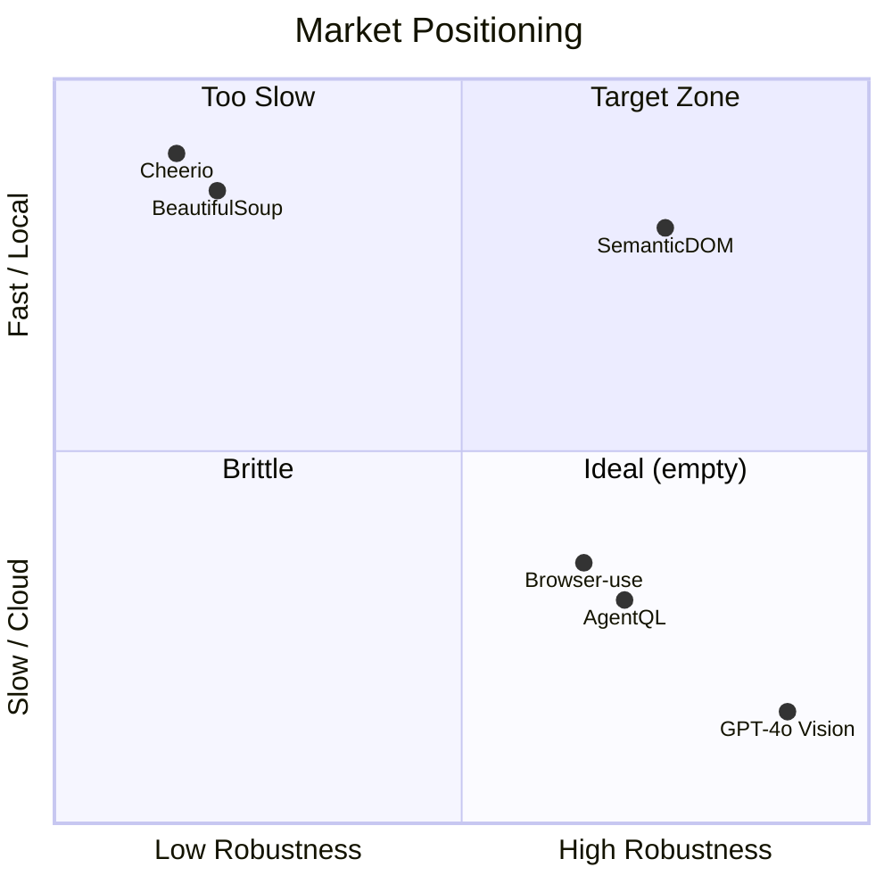
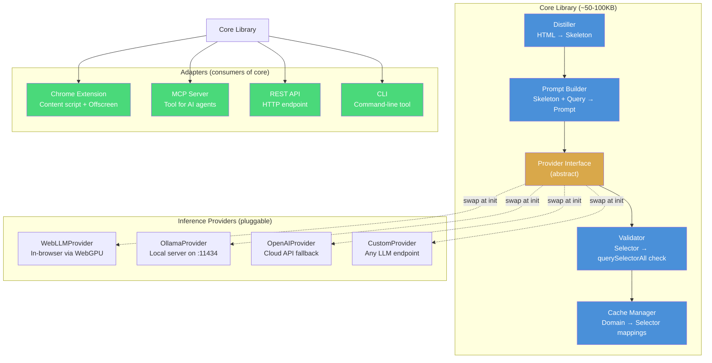
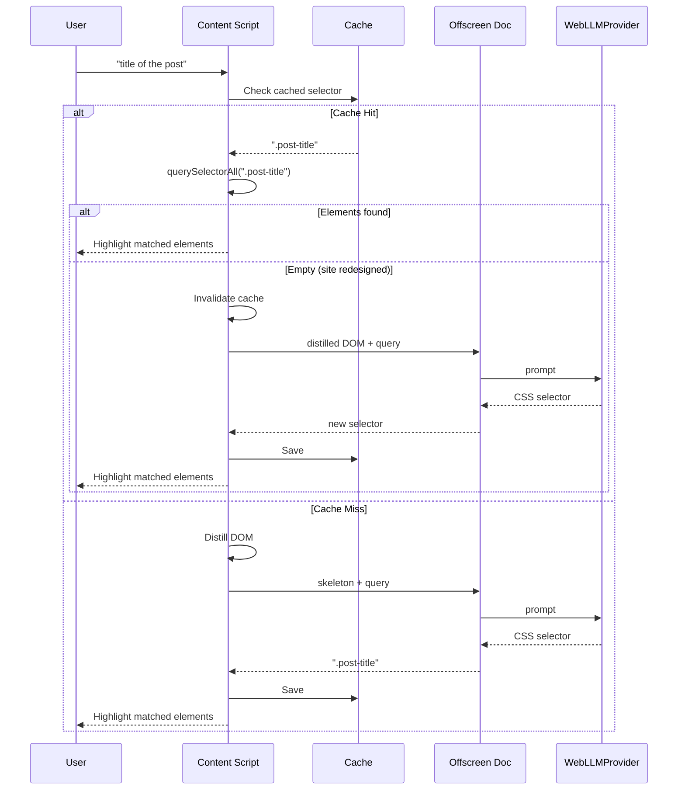
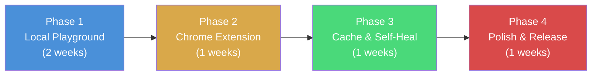
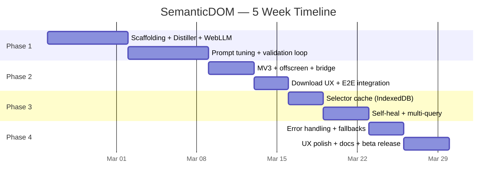

# SemanticDOM — Project Proposal

## Natural Language to DOM: A Semantic Selector Engine

**Project:** SemanticDOM  
**Date:** February 2026 
**Status:** Pending 
**Parent Project:** Personal Information Agent (Privacy-First and Democratized Content Filtering)  
**Evaluation:** [See Section 13 — Evaluation & Risk Analysis](#13-evaluation--risk-analysis)

---

## 1. Executive Summary

Online platforms optimize content for engagement, not user well-being. The long-term vision is a **Personal Information Agent** — a local digital twin that previews, filters, and organizes web content aligned with a user's goals and emotional state.

Before that agent can exist, it needs infrastructure to **operate on arbitrary websites** that constantly evolve in design. SemanticDOM is that infrastructure: a model-agnostic core library that translates natural language queries into CSS selectors, enabling programmatic manipulation of any website without brittle, hard-coded selectors. The library ships with no AI model embedded — instead, it uses a pluggable provider interface to connect to any inference backend (in-browser WebGPU, local Ollama, or cloud APIs).

```
// Today (brittle)
document.querySelectorAll("article > .item")

// SemanticDOM (resilient)
semanticDOM.select("posts in the feed")
```

The key output is a **DOM element** (or NodeList) that JavaScript can modify directly — hide, highlight, blur, translate, or rearrange.

---

## 2. Problem Statement

| Problem | Impact |
|---|---|
| CSS selectors break when sites redesign | Extensions and scrapers require constant maintenance |
| No standard way to describe page elements in natural language | Users cannot express intent like "hide clickbait" programmatically |
| Cloud-based AI agents send full page data to servers | Privacy violation for a personal filtering tool |
| Vision-based approaches (screenshot + VLM) take 2-5 seconds | Causes layout shift; unusable for real-time UI modification |

---

## 3. Market Research Summary

### 3.1 Competitive Landscape

| Approach | Examples | Latency | Privacy | Robustness | Verdict |
|---|---|---|---|---|---|
| **A. DOM Distillation + LLM** | Browser-use, AgentQL, LangChain WebAgent | ~1-2s | Local possible | High | **Best fit** |
| **B. Vision / Screenshot** | Tarsier, SeeAct-V, GPT-4o | 2-5s | Cloud-dependent | Very High | Too slow for real-time |
| **C. Heuristic / Rule-based** | Cheerio, BeautifulSoup, Selenium | <10ms | Local | Low (brittle) | Breaks on redesign |

### 3.2 Market Gap

SemanticDOM occupies the gap between brittle scrapers and heavyweight cloud agents:



---

## 4. Technical Architecture

### 4.1 Design Philosophy: Core Library + Adapters

SemanticDOM is **not** an extension. It is a **model-agnostic core library** with multiple adapter layers. The library itself is ~50-100KB of pure JS/TS — it handles DOM distillation, prompt construction, selector validation, and caching. The AI model is always external, supplied via a pluggable **provider interface**.

This means SemanticDOM can run anywhere: in a browser extension, a Node.js server, a CLI tool, or as an MCP server for AI agents.



### 4.2 Core Library Internals

The core library owns four responsibilities. Everything else is external.

| Component | Responsibility | Notes |
|---|---|---|
| **Distiller** | `HTML string → Skeleton` | Strips `<script>`, `<style>`, SVGs, noisy attributes. Keeps structural tags + text snippets. Uses a **Class Heuristic** to retain semantic classes (containing `post`, `title`, `item`, `card`, `wrapper`) while discarding utility classes (containing `p-`, `m-`, `flex`, `w-`, `h-`, `bg-`). Always preserves `aria-label`, `role`, and `id`. Pure JS, no DOM APIs needed. ⚠️ *This is the accuracy bottleneck — see [Section 13.2 Risk A](#132-technical-risks).* |
| **Prompt Builder** | `Skeleton + Query → LLM Prompt` | Constructs the inference prompt. Handles retry prompts when validation fails. |
| **Validator** | `CSS Selector → pass/fail` | Runs `querySelectorAll` (or a CSS parser in Node) to verify the selector is syntactically valid and matches elements. |
| **Cache Manager** | `Domain → Query → Selector` | Stores and retrieves cached selectors. Stores the **original user intent** (natural language query) alongside the selector so the self-healing loop can re-run inference automatically when a cached selector goes stale. Adapter-agnostic (IndexedDB in browser, file/SQLite in Node). |

### 4.3 Provider Interface

The library ships with no model. Instead, it defines a simple interface that any inference backend must implement:

```typescript
interface SemanticProvider {
  /** One-time setup (download model, connect to server, etc.) */
  init(): Promise<void>;

  /** Send a prompt, get text back */
  complete(prompt: string): Promise<string>;

  /** Optional: abort an in-flight inference (e.g., user navigates away) */
  cancel?(): Promise<void>;

  /** Optional: cleanup resources */
  dispose?(): Promise<void>;
}
```

> **Design Note (from evaluation):** The `cancel()` method was added to allow aborting GPU inference when the user navigates away mid-query. Without this, the WebGPU process would continue burning resources on a stale request.

Built-in providers:

| Provider | Environment | Model Location | Latency |
|---|---|---|---|
| `WebLLMProvider` | Browser (extension) | Downloaded to Cache Storage via WebGPU | ~1-2s first run, cached after |
| `OllamaProvider` | Node.js / CLI / MCP | Local Ollama server (`localhost:11434`) | ~0.5-1s |
| `OpenAIProvider` | Anywhere | Cloud API (OpenAI, Anthropic, etc.) | ~0.3-1s (network dependent) |
| `CustomProvider` | Anywhere | Any endpoint implementing `complete()` | Varies |

### 4.4 Adapter Layer

Each adapter wraps the core library for a specific distribution surface:


| Adapter | Use Case | How It Gets HTML | Default Provider |
|---|---|---|---|
| **Chrome Extension** | End-users filtering live pages | Content script reads `document.body` | `WebLLMProvider` (local, in-browser) |
| **MCP Server** | AI agents (web agent, coding assistants) | Puppeteer/Playwright fetches URL headlessly | `OllamaProvider` (local server) |
| **REST API** | External services, other languages | Client sends HTML in request body | `OllamaProvider` or `OpenAIProvider` |
| **CLI** | Scripting, pipelines, quick testing | Puppeteer fetches URL | `OllamaProvider` |

### 4.5 Data Flow — Query Lifecycle (Extension Adapter)



### 4.6 Technology Stack

| Component | Technology | Rationale |
|---|---|---|
| Core Library | TypeScript, pure JS | No runtime dependencies, runs anywhere |
| Provider: Browser | **WebLLM** (WebGPU) | Best in-browser LLM performance |
| Provider: Local | **Ollama** | Simple local model server, wide model support |
| Provider: Cloud | OpenAI / Anthropic API | Fallback for quick prototyping |
| Recommended Model | **Phi-3.5 Mini Instruct** (3.8B, q4) | Best reasoning-to-size ratio for HTML tasks |
| Lightweight Model | **Llama-3.2 1B Instruct** | For low-memory devices / browser extension |
| Build Tool | Vite | Fast dev, good extension bundling |
| Extension API | Chrome Manifest V3 + `chrome.offscreen` | Required for persistent WebGPU in extension |
| Caching | IndexedDB (browser) / SQLite (Node) | Adapter-appropriate storage |
| MCP | Model Context Protocol SDK | Standard agent tool interface |
| CLI | Commander.js + Puppeteer | URL fetching + argument parsing |

---

## 5. The Hybrid Strategy (Cache & Self-Heal)

Running the LLM on every page load is too slow and battery-intensive. The core innovation is a **Cache & Self-Heal** loop:

1. **First Visit:** LLM analyzes the page structure (~1-2s). Returns a CSS selector.
2. **Cache:** Selector is saved per domain (e.g., `reddit.com → { "post title": ".post-title" }`). The original user intent (natural language query) is stored alongside the selector to enable automatic re-inference.
3. **Subsequent Visits:** Cached selector is applied instantly (< 10ms).
4. **Self-Healing:** If `querySelectorAll` returns empty (site redesigned), the LLM re-runs in the background using the stored intent to discover the new selector. No user intervention needed.

### 5.1 Cold Start Strategy (Hybrid Cloud → Local)

> **Added from evaluation feedback.** The 2GB model download before first use is a high barrier to entry.

Asking a user to download 2GB before they see anything work will cause drop-off. The solution is a **Hybrid Model** for first-run UX:

1. **First Run (Cloud):** When the user installs the extension, use a cheap cloud API (OpenAI `gpt-4o-mini` or a hosted endpoint) for the first ~10 queries. This is instant and requires no download.
2. **Background Download:** While the user is actively using the cloud-backed version, download the Phi-3.5 model in the background via Cache Storage.
3. **Silent Switch:** Once the model is fully downloaded, silently swap the provider from `OpenAIProvider` → `WebLLMProvider`. The user never notices the transition.

This validates the user's need ("this works") before asking for their storage space.

```typescript
// Cold start implementation sketch
const engine = new SemanticSelector({
  provider: new HybridProvider({
    immediate: new OpenAIProvider({ model: 'gpt-4o-mini' }),  // instant, cloud
    target: new WebLLMProvider({ model: 'phi-3.5-mini' }),     // local, downloads in background
    switchAfterReady: true,
  }),
  cache: 'indexeddb',
});
```

---

## 6. Feasibility Assessment

| Factor | Rating | Notes |
|---|---|---|
| **Overall Feasibility** | **High** | Core tech (WebGPU, WebLLM, SLMs) is mature enough |
| WebGPU Browser Support | ✅ | Chrome 113+, Edge, Firefox (behind flag) |
| Model Performance | ✅ | 30-90 tokens/sec on M1+ Mac or NVIDIA GPU |
| Library Maturity | ✅ | WebLLM ships with Phi-3 Mini 4k Instruct ready to use |

### 6.1 Known Constraints & Mitigations

| Constraint | Impact | Mitigation |
|---|---|---|
| Initial model download (~1.5-2 GB) | Poor first-run UX | Progress bar UI; store in Cache Storage |
| Memory pressure (50+ tabs) | Browser may kill extension | Use 1B model for consumer release; lazy-load |
| Battery drain from constant inference | Laptop battery impact | Aggressive caching; only re-infer on cache miss |
| Shadow DOM / deeply nested layouts | Distillation may lose context | Fallback to fuzzy text search; iterative prompting |
| Chrome Web Store size limits | Cannot bundle model in .crx | Download model on first run, not at install |

---

## 7. Repository Structure

```
/packages
  /core                 The library: Distiller, Prompt Builder, Validator, Cache Manager
  /providers
    /webllm             WebLLMProvider (browser, WebGPU)
    /ollama             OllamaProvider (local server)
    /openai             OpenAIProvider (cloud fallback)
  /adapters
    /chrome-extension   MV3 extension: content script, offscreen doc, popup UI
    /mcp-server         MCP tool server for AI agents
    /rest-api           Express/Hono HTTP wrapper
    /cli                Command-line interface
  /shared-types         TypeScript interfaces (SemanticProvider, config, etc.)
```

---

## 8. Development Phases & Timeline

### Phase Overview




### Phase 1 — Local Playground & Distiller Tuning (Weeks 1-2)

**Goal:** Prove that a small language model can reliably translate natural language → CSS selectors from distilled HTML. **Primary focus: get the Distiller right.** If the Distiller is bad, the best AI model will fail.

**Environment:** Vite web app on `localhost:3000`. No extension complexity.

| Week | Deliverable |
|---|---|
| 1 | Project scaffolding. **DOM Distiller v1** with Class Heuristic (strip `<script>`, `<style>`, SVGs; keep semantic classes, discard utility classes; preserve `aria-label`, `role`, `id`). Scrape 10 popular sites (Reddit, Twitter, Amazon, Wikipedia, NYTimes, HN, YouTube, GitHub, Medium, StackOverflow) and output skeleton HTML. **Manual validation:** feed skeletons to ChatGPT — if it can't find the selector, Phi-3 won't either. Tune Distiller until ChatGPT gets 10/10. WebLLM integration with Phi-3.5 Mini. Basic prompt engineering. |
| 2 | Prompt refinement against 5+ real sites. Validation loop for invalid selectors. **Confidence scoring via match-count heuristic** (see Section 9.2). Target: 90% accuracy. |

**Success Metric:** Consistently returns valid CSS selectors for common page elements across 5 different websites.

**Key Risk:** Model hallucinating invalid CSS syntax. Mitigated by validation loop + constrained output format.

> **Evaluation note:** 80% of Phase 1 effort should go into the Distiller. The LLM integration is the easy part — the quality of the skeleton HTML is the bottleneck for accuracy.

---

### Phase 2 — Chrome Extension (Week 3)

**Goal:** Move the working prototype into a Chrome Manifest V3 extension using the split architecture.

| Day | Deliverable |
|---|---|
| 1-2 | Extension scaffolding. Manifest V3 setup. Content script injection. Popup UI. **Test CSP + WebGPU in offscreen document immediately** (key risk). |
| 3-4 | Offscreen document (`brain.html`). WebLLM in offscreen context. Chrome messaging bridge. |
| 5-7 | Model download UX (progress bar, Cache Storage). End-to-end integration: query → distill → infer → highlight. **Optimistic loading state:** show spinner on extension icon during inference; do not modify DOM until selector is confirmed. Optionally, try instant regex match on common patterns (`article`, `[role="article"]`) while AI confirms the specific selector in the background. |

**Success Metric:** Extension works on Reddit and Hacker News. User types "post title" and sees correct elements highlighted.

**Key Risk:** CSP blocking WebGPU in offscreen document. Mitigated by testing early on Day 1.

> **Evaluation note (Layout Shift UX):** On first visit, there is a ~2s lag while the AI finds the selector. If the user starts reading and content suddenly vanishes or highlights, it feels broken. The "Optimistic Loading State" pattern prevents this — never modify the DOM until the selector is confirmed.

---

### Phase 3 — Cache & Self-Heal (Week 4)

**Goal:** Make it fast for repeat visits and resilient to site redesigns and dynamic content.

| Day | Deliverable |
|---|---|
| 1-2 | Selector caching system. Domain → query → selector mappings in IndexedDB. **Store original user intent alongside selector** for automatic re-inference. Instant application on cached sites. |
| 3-5 | Self-healing logic. Detect stale selectors, trigger background re-inference using stored intent. **MutationObserver** in Content Script to re-apply cached selectors on dynamically loaded DOM nodes (critical for SPAs like Twitter). Only re-run the cached selector on new nodes — do not re-run the AI. |
| 6-7 | Multi-query support per site (e.g., "post title" + "comment body" + "vote count"). |

**Success Metric:** Cached selectors apply in < 10ms. Self-healing recovers from a simulated site redesign within one page load. Dynamic content (infinite scroll) is handled without re-inference.

---

### Phase 4 — Polish & Release (Week 5)

**Goal:** Production-ready extension suitable for public beta.

| Day | Deliverable |
|---|---|
| 1-2 | Error handling & edge cases. Graceful fallbacks for no-WebGPU browsers. Memory management. |
| 3-4 | UX polish. Settings page (model selection, cache management). Loading indicators during inference. |
| 5-7 | Documentation, README, API docs. Chrome Web Store listing prep. Beta release. |

**Success Metric:** Extension installs cleanly, downloads model on first run, and works across 10+ popular websites without manual configuration.

---

### Gantt Chart



---

## 9. API Design (Target Interface)

### 9.1 Core Library — Provider Pattern

```typescript
import { SemanticSelector } from '@semanticdom/core';
import { WebLLMProvider } from '@semanticdom/provider-webllm';
import { OllamaProvider } from '@semanticdom/provider-ollama';
import { OpenAIProvider } from '@semanticdom/provider-openai';

// Browser extension — local, in-browser inference via WebGPU
const engine = new SemanticSelector({
  provider: new WebLLMProvider({ model: 'phi-3.5-mini-instruct-q4f16_1' }),
  cache: 'indexeddb',
});

// Node.js / CLI / MCP — local Ollama server
const engine = new SemanticSelector({
  provider: new OllamaProvider({ model: 'phi3.5', endpoint: 'http://localhost:11434' }),
  cache: 'sqlite',
});

// Quick prototyping — cloud API
const engine = new SemanticSelector({
  provider: new OpenAIProvider({ model: 'gpt-4o-mini', apiKey: process.env.OPENAI_KEY }),
  cache: 'memory',
});

await engine.init();
```

### 9.2 Selection API (same across all providers)

```typescript
// From HTML string (Node.js, CLI, MCP, API)
const selector = await engine.resolve(htmlString, "post titles");
// Returns: { selector: "article h3.title", confidence: 0.95 }

// From live DOM (browser extension only)
const nodes = await engine.select("post titles");
// Returns: NodeList [<h3>, <h3>, <h3>, ...]

// Direct manipulation (extension)
nodes.forEach(el => el.style.border = '2px solid red');
```

**Confidence Score — Verification-Based Approach:**

Rather than extracting raw logits from the model (complex and provider-dependent), confidence is derived from the Validator's match count:

| Match Count | Confidence | Interpretation |
|---|---|---|
| 0 matches | `0.0` | Fail — selector is invalid or site redesigned |
| 1 match | `0.5` | Ambiguous — could be a unique element (title) or a false positive (footer) |
| 10-50 matches | `1.0` | Strong — looks like a feed or repeated element |
| 500+ matches | `0.2` | Too generic — likely matched `div` or `span` |

> This heuristic is simple, provider-agnostic, and works without access to model internals.

### 9.3 MCP Tool Interface

```typescript
// What an AI agent sees as an MCP tool
{
  name: "semantic_select",
  description: "Find DOM elements on a webpage using natural language",
  inputSchema: {
    url: "https://reddit.com/r/programming",
    query: "post titles"
  }
}

// Returns
{
  selector: "a[data-testid='post-title']",
  matchCount: 25,
  sampleText: ["Show HN: ...", "Why Rust...", "Ask HN: ..."]
}
```

### 9.4 CLI Interface

```bash
# Basic usage
$ semanticdom select --url https://reddit.com --query "post titles"
# Output: a[data-testid='post-title'] (25 matches)

# With specific provider
$ semanticdom select --url https://news.ycombinator.com --query "story links" --provider ollama

# Extract text content
$ semanticdom extract --url https://reddit.com --query "post titles" --format json
# Output: ["Show HN: ...", "Why Rust...", "Ask HN: ..."]
```

### 9.5 Cache Management

```typescript
engine.clearCache('reddit.com');
engine.getCachedSelectors();
// { "reddit.com": { "post titles": "article h3.title", "vote count": "span.score" } }
```

---

## 10. Success Criteria

| Milestone | Week | Criteria | Target |
|---|---|---|---|
| **Phase 1 Gate** | End of Week 2 | Model returns valid CSS selectors from distilled HTML | ≥ 90% accuracy across 5 test sites |
| **Phase 2 Gate** | End of Week 3 | Extension runs end-to-end in Chrome | Works on Reddit + HN without errors |
| **Phase 3 Gate** | End of Week 4 | Cached selectors apply instantly; self-heal on redesign | Cache hit < 10ms; recovery within 1 page load |
| **Phase 4 Gate** | End of Week 5 | Public beta release | Installs cleanly; works on 10+ sites |

---

## 11. Out of Scope (for this phase)

These belong to the broader Personal Information Agent project but are explicitly excluded from SemanticDOM v1:

- Content sentiment analysis or toxicity detection
- User emotional state modeling
- Cross-tab or cross-session agent memory
- Fine-tuning or training custom models
- Firefox / Safari extension ports
- MCP server adapter (v1 focuses on core library + Chrome extension; MCP/API/CLI adapters are v2)

---

## 12. Open Questions

1. **Model selection finalization:** Should we default to Phi-3.5 Mini (better reasoning, ~2GB) or Llama-3.2 1B (lighter, ~800MB)? Needs benchmarking in Phase 1.
2. **Shadow DOM handling:** How deep should the distiller traverse shadow roots? Some modern frameworks (Lit, Salesforce Lightning) rely heavily on shadow DOM.
3. ~~**Dynamic content (SPAs):** Sites like Twitter load content dynamically. Should the Eye use a MutationObserver to re-apply selectors on new DOM nodes?~~ **→ Resolved: Yes, MutationObserver is required.** Promoted to a Phase 3 deliverable. The Eye re-applies cached selectors on new nodes only — no AI re-inference needed. See Phase 3 updates.
4. **Selector specificity:** When the model returns a selector that matches too many or too few elements, what's the retry strategy? **→ Partially resolved:** The confidence score heuristic (Section 9.2) detects over-matching (500+ → confidence 0.2) and under-matching (0 → confidence 0.0). Retry strategy: prompt refinement with the match count as feedback to the LLM. Interactive narrowing deferred to v2.
